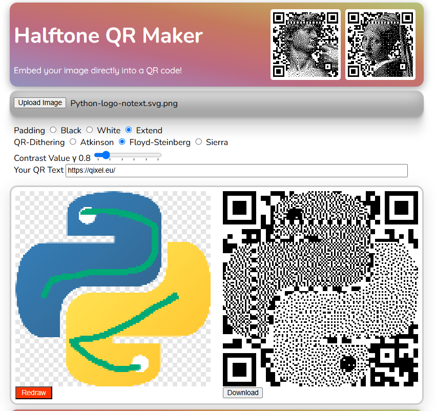

# Qixel Halftone QR-Code Generator

A QR-Code generator that uses Error Diffusion Dithering to insert an image directly into the scannable module matrix. Available at [qixel.eu](https://qixel.eu).
## Idea
The idea came from [this publication](https://cgv.cs.nthu.edu.tw/projects/Recreational_Graphics/Halftone_QRCodes) by Chu et al. (NTHU CGV LAB) about "Halftone QR-Codes". But instead of using a complex embedding process like they describe, this project relies on the following steps:
- Manually mark regions of interest (foreground)
- Apply the [GrabCut algorithm](https://en.wikipedia.org/wiki/GrabCut#:~:text=GrabCut%20is%20an%20image%20segmentation,using%20a%20Gaussian%20mixture%20model.) to cut out connected regions
- Transform from RGB to a monochrome image
- Dither the cut out region using a binary color palette (halftoning) to simulate shading.
    - One of the best algorithms for this is Floyd Steinberg
    - Instead of using error diffusion only on the image itself, in a 3x3 region, always use 1 center pixel from the qr code and calculate the 8 surrounding pixels from the image
    - The error introduced by the embedded QR code is then spread out using error diffusion
- In the end: Overlay the QR code and the halftone image 

## Similar Projects
There is one very similar project available online, be sure to check it out:
[Nthrox' Halftone QR-Code Generator](https://nythrox.github.io/halftone-qrcode/)

Halftone Pixel QR-Code Generator.
QR Code is a registered trademark
of DENSO WAVE INCORPORATED.

© 2025 [ajgl.blog](https://ajgl.blog)
